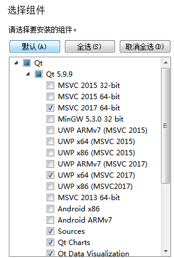
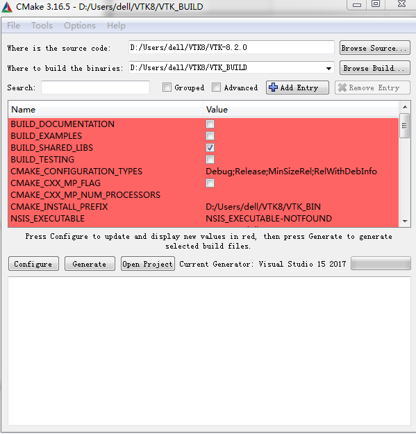

# Install VTK and Qt on Windows

It is a little cumbersom to compile VTK and Qt on Windows, different versions of them may not build sucessfully.

### required packages

1. [VTK 8.2.0](https://vtk.org/download/)  Download souce and data zips

2. [Qt5.9.9](http://download.qt.io/community_releases/)

3. [CMake](https://cmake.org/)

4. [Visual studio code 2017](https://visualstudio.microsoft.com/zh-hans/vs/older-downloads/)

   I have these versions and try several example ,and end up with success.

1.  Install CMake and VS2017 first

2.  Install Qt,choose 

   

   select the knits you need,especially msvc , and some other tools on the bottom

   3. Unzip VTK-8.2.0 and VTKDATA-8.2.0 . And create a directory "**build**"

   4. Open CMake.exe

      

      ​            souce code is where the VTK and build in the empty directory.

      choose mscv2017 compiler and choose x64 or win32

      click configure  ----> click advanced ---> 

      check :

      BUILD_EXAMPLES;

      VTK_Group_Qt;

      Module_vtkGUISupportQtOpenGL;

      Module_vtkGUISupportQt;

      Module_vtkRenderingQt;

      Module_vtkViewsQt

      change **CMAKE_INSTALL_PREFIX** directory : like $VTK/VTK_bin

      ----> config again

      (if it doesn't find out qt version ,you should add where Qtconfig.cmake file is located, usually like :qt5.9.9\5.9.9\msvc2017_64\lib\cmake\Qt5)

      ------>click generate

      -------> open project

      5. 

         choose ALL_BUILD and click **build**

         once done,choose INSTALL ,click **Only for this project** and "**build for generate**"

         6. Set environment variables

            1. Create a new environment variable  **QTDIR** : D:\Qt5\qt5.9.9

            2. Add to PATH: (use **;** to seperate)

               D:\VTK8\VTK_BUILD\bin\Release;

               D:\Qt5\qt5.9.9\5.9.9\msvc2017_64\bin;

               D:\Qt5\qt5.9.9\Tools\QtCreator\bin;

               D:\\vs2017;

         7.  Then download the test project to test if it work.  It comes from [lorensen](https://lorensen.github.io/VTKExamples/site/Cxx/Qt/RenderWindowUISingleInheritance/). I downloaded and make a little change, put it in example directory for convience.

         8. **cmake** first, configure and generate

​						 9. openproject then  build

It works!

